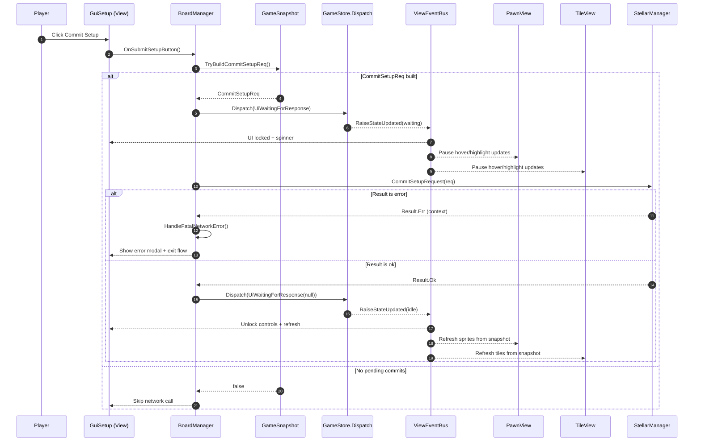
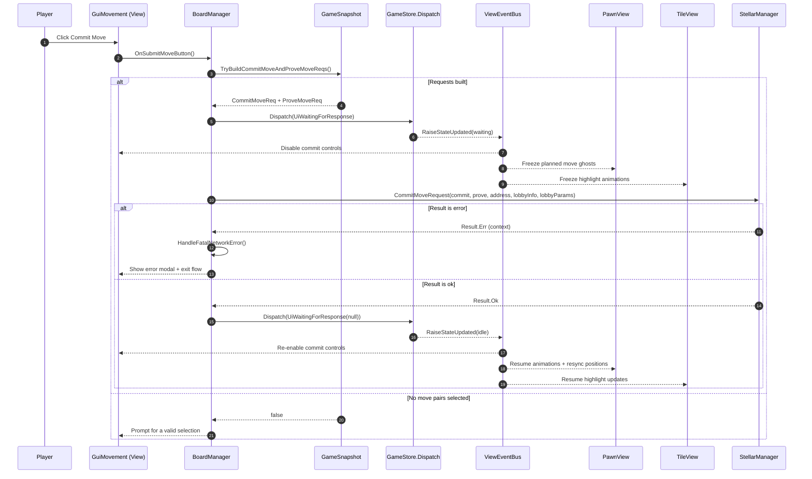

# Network Action Sequence Reference

This document outlines the end-to-end flow for the two major state-changing gameplay actions—**Commit Setup** and **Commit Move**—from the player facing buttons through network calls and back to the Unity views. Each diagram includes the optimistic path, the view update broadcasts, and the error propagation branches that surface external failures to the player.

## Commit Setup flow



### View listeners and fan-out

* `GameStore.Dispatch` forwards reducer events into `ViewEventBus.RaiseStateUpdated`, which wakes any subscribed view when UI or network state changes.【F:Assets/Scripts/GameState/GameStore.cs†L25-L84】【F:Assets/Scripts/GameState/Effects/ViewAdapterEffects.cs†L14-L65】【F:Assets/Scripts/GameState/ViewEventBus.cs†L6-L52】
* UI layers subscribe to those events to refresh controls, disable inputs while waiting, and react to hover/selection updates: `GuiSetup`, `GuiMovement`, `GuiGame`, `CursorController`, `TileView`, and `PawnView` all attach via `ViewEventBus` subscriptions.【F:Assets/Scripts/UI/GameUi/GuiSetup.cs†L37-L139】【F:Assets/Scripts/UI/GameUi/GuiMovement.cs†L53-L119】【F:Assets/Scripts/UI/GuiGame.cs†L31-L134】【F:Assets/Scripts/UI/CursorController.cs†L17-L101】【F:Assets/Scripts/Board/TileView.cs†L93-L200】【F:Assets/Scripts/Board/PawnView.cs†L43-L160】
* The diagrams end at the `StellarManager` boundary; internally the manager fans out into the single- and multiplayer branches before raising `OnGameStateBeforeApplied`, which `BoardManager` feeds back into the store as a `NetworkStateChanged` action. The `NetworkReducer` may emit a `ClientModeChangedEvent`, which `ViewAdapterEffects` relays to the bus, triggering the same view listeners.【F:Assets/Scripts/Stellar/StellarManager.cs†L176-L250】【F:Assets/Scripts/BoardManager.cs†L110-L200】【F:Assets/Scripts/GameState/Reducers/NetworkReducer.cs†L5-L43】【F:Assets/Scripts/GameState/Effects/ViewAdapterEffects.cs†L14-L65】

### Error propagation

* Any network-side failure returns a `Result<bool>.Err` enriched by `ErrWithContext`, ensuring the player sees a contextual message.【F:Assets/Scripts/Stellar/StellarManager.cs†L43-L53】【F:Assets/Scripts/Stellar/StellarManager.cs†L343-L383】
* `BoardManager` responds to those errors by calling `HandleFatalNetworkError`, which opens a modal and kicks the player back to the menu—covering outages that are outside of game control.【F:Assets/Scripts/BoardManager.cs†L260-L333】

## Commit Move flow



### Additional notes for move commitments

* `GameSnapshot.TryBuildCommitMoveAndProveMoveReqs` hashes each planned move, caches the hidden moves for later proofs, and only succeeds when the local player is allowed to act and has at least one pair queued.【F:Assets/Scripts/GameState/GameSnapshot.cs†L74-L127】
* In security-enabled games, the online path tries to batch `commit_move` with `prove_move`; otherwise it falls back to a plain commit, ensuring compatibility with mixed subphase timing.【F:Assets/Scripts/Stellar/StellarManager.cs†L386-L440】
* The same waiting-state dispatch keeps movement UI, cursor, tile highlights, and pawn animations in sync while the transaction is in flight.【F:Assets/Scripts/GameState/Reducers/UiReducer.cs†L13-L200】【F:Assets/Scripts/GameState/Effects/ViewAdapterEffects.cs†L14-L65】【F:Assets/Scripts/GameState/ViewEventBus.cs†L6-L52】【F:Assets/Scripts/Board/TileView.cs†L93-L200】【F:Assets/Scripts/Board/PawnView.cs†L43-L160】
* Errors surface identically via `HandleFatalNetworkError`, covering issues like RPC outages, transaction failures, or opponent proofs that cannot be retrieved.【F:Assets/Scripts/BoardManager.cs†L285-L333】【F:Assets/Scripts/Stellar/StellarManager.cs†L386-L440】

```
